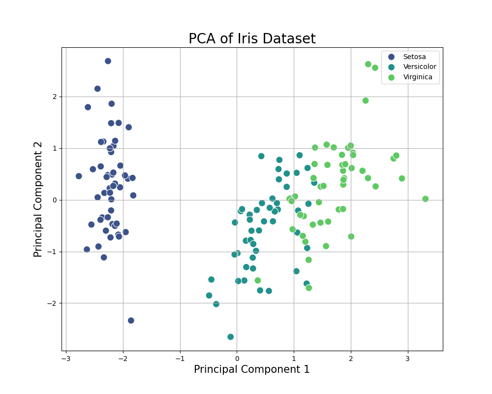

# PCA_of_Iris_Dataset
# Assignment 1: Principal Component Analysis (PCA) on the Iris Dataset

## Project Overview

This project is an implementation of Principal Component Analysis (PCA) on the classic Iris flower dataset. The goal is to reduce the dimensionality of the dataset from four features to two principal components and visualize the results to see if the different flower species form distinct clusters.

This was completed for Assignment 1.

---

## Files in this Repository

* `pca_iris.py`: The main Python script that loads the data, performs scaling, runs PCA, and generates the output plot.
* `iris_pca_plot.png`: The final visualization showing the clustered results of the PCA.

---

## How to Run

1.  **Prerequisites:** Ensure you have Python and the following libraries installed:
    ```bash
    pip install pandas scikit-learn matplotlib seaborn
    ```

2.  **Execute the script:** Run the main file from your terminal:
    ```bash
    python pca_iris.py
    ```

---

## Results

The script will generate a 2D scatter plot of the first two principal components. These two components capture approximately **95.81%** of the total variance in the original data.

As shown in the plot below, the three species of Iris form clearly distinct clusters, demonstrating the effectiveness of PCA for dimensionality reduction and data visualization.


